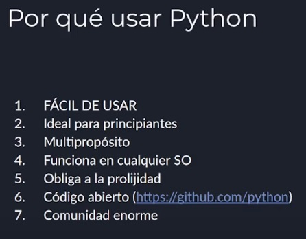
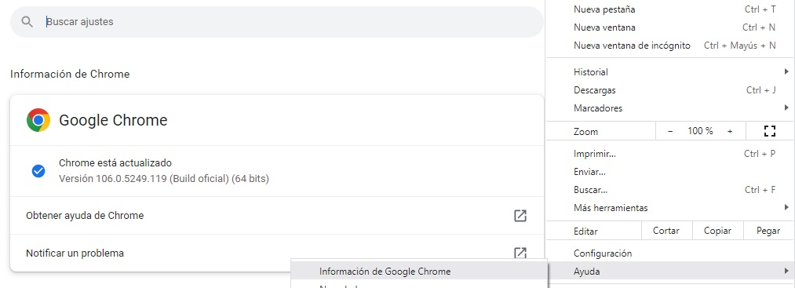
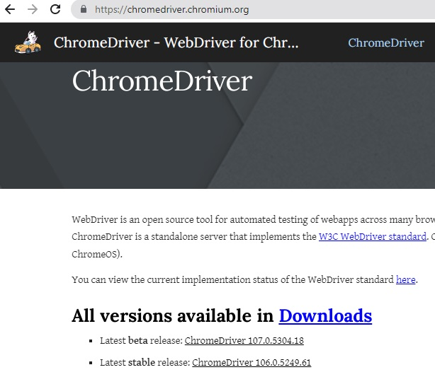
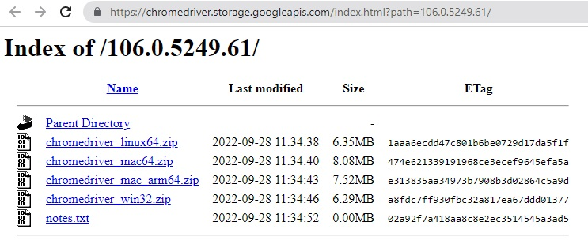
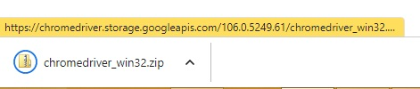

# selenium-python

# Gestor de descargas: pip
En Windows : `pip install selenium`.
# Webdriver  
* Selenium funciona gracias a un programa llamado **Webdriver**.  
* Cada **navegador** tiene su propio **Webdriver**.  
https://chromedriver.chromium.org/  




  

```python
from selenium import webdriver
from time import sleep
from selenium.webdriver.chrome.service import Service

driver_service = Service(executable_path='./driver/chromedriver.exe')
driver = webdriver.Chrome(service=driver_service)
driver.maximize_window()
driver.get('http://www.google.com')
driver.find_element('name','q').send_keys('Selenium')
sleep(1)
driver.close()
driver.quit()
```
* Cuando cargmos una pagina web tarda un tiempo en cargarse según nuestra velocidad de conexion, hasta que estos elementos no carguen no vamos a realizar ninguna operación.    
```python
from selenium.webdriver.support.ui import WebDriverWait
```